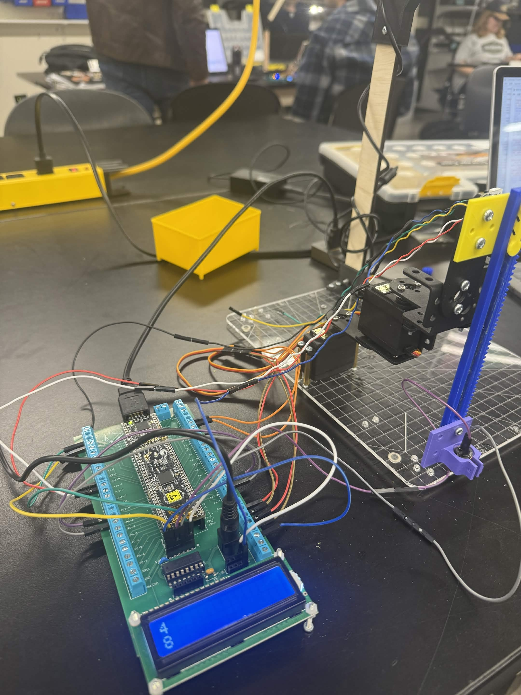

<h1 style="text-align: center; font-size: 4rem; margin-bottom: 0.5rem;">
Computer Vision Guided Pick-and-Place Robot
</h1>

{ style="display: block; margin: 1rem auto 2rem auto; width: 85%; max-width: 900px; border-radius: 16px;" }

<h2 style="margin-top: 1.5rem;">Robotic Systems Project</h2>

<strong>Arizona State University Polytechnic</strong> 
<strong>Course:</strong> Robotic Systems (EGR455/456)

Designed and implemented an autonomous pick-and-place robotic system capable of locating objects using computer vision, calculating their position within a robot workspace, and automatically moving a two-degree-of-freedom manipulator to retrieve and relocate the object.

The project integrated Python-based image processing, embedded C development, UART communication, inverse kinematics, and servo motor control into a complete robotic automation system.

---

## Demonstration Video

<iframe 
    src="https://www.youtube.com/embed/zRHQQDa_Oro"
    title="Robotic System Demonstration"
    frameborder="0"
    allow="accelerometer; autoplay; clipboard-write; encrypted-media; gyroscope; picture-in-picture; web-share"
    allowfullscreen
    style="position: absolute; top: 0; left: 0; width: 100%; height: 100%;">
</iframe>

---

## System Architecture
The system consisted of two primary subsystems working together:

- Python-based computer vision application
- PSoC-based robotic manipulator controller

The vision system identified object locations within the camera frame and transformed those measurements into workspace coordinates. These coordinates were transmitted over UART to the embedded controller, which calculated the required joint angles and executed the pick-and-place sequence.

---

## Technical Highlights

This project combined multiple robotics disciplines into a single autonomous system. A Python application utilized OpenCV to detect object locations within a camera frame and convert pixel measurements into real-world coordinates. These coordinates were transmitted to a PSoC microcontroller over UART communication, where inverse kinematic calculations determined the required manipulator joint angles.

The embedded controller then commanded two servo motors and an electromagnet-based end effector to autonomously perform object retrieval and relocation. The result was a complete hardware-software system capable of identifying, locating, and manipulating objects without human intervention.

---

## Key Engineering Contributions

### Computer Vision Development

Developed an OpenCV-based vision system utilizing image differencing, thresholding, centroid calculations, and coordinate transformations to determine object locations within the robot workspace.

### Embedded Systems Programming

Developed embedded software in PSoC Creator using C to receive workspace coordinates, process UART communications, execute inverse kinematic calculations, and control robotic motion.

### Robotic Manipulation

Implemented inverse kinematic algorithms and PWM-based servo control for a two-link robotic manipulator, enabling accurate object positioning and repeatable pick-and-place operations.

### Systems Integration

Integrated computer vision, embedded control, serial communication, and robotic actuation into a fully autonomous robotic system.

---

## Technical Skills Demonstrated

<ul>
<li>Computer Vision</li>
<li>OpenCV</li>
<li>Python Programming</li>
<li>Image Processing</li>
<li>Coordinate Transformations</li>
<li>UART Communication</li>
</ul>

<ul>
<li>Embedded C</li>
<li>PSoC Development</li>
<li>Inverse Kinematics</li>
<li>PWM Motor Control</li>
<li>Robotics</li>
<li>Systems Integration</li>
</ul>

---

## Key Outcomes

- Developed a complete computer vision guided robotic automation system
- Implemented object localization using image processing techniques
- Applied inverse kinematics to control a two-degree-of-freedom manipulator
- Demonstrated autonomous object retrieval and relocation through integrated hardware and software systems